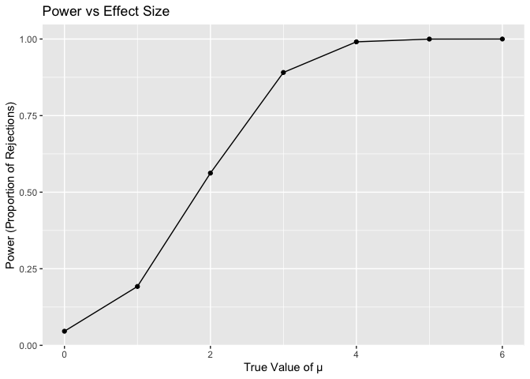
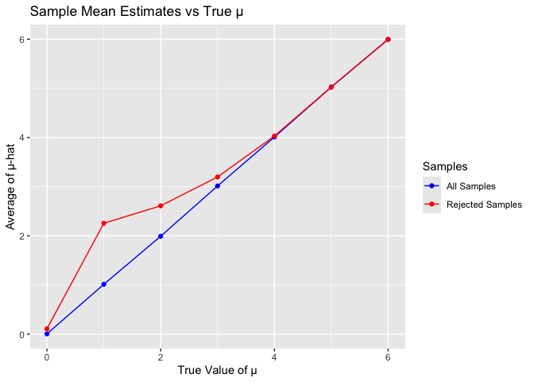
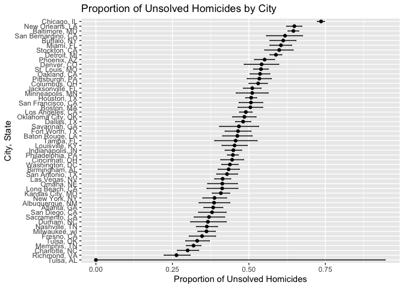

p8105_hw5_tp2859
================
Tingcheng Pan
2024-11-11

``` r
knitr::opts_chunk$set(echo = TRUE)
```

``` r
# Load necessary libraries
library(broom)
```

    ## Warning: package 'broom' was built under R version 4.3.3

``` r
library(dplyr)
```

    ## 
    ## Attaching package: 'dplyr'

    ## The following objects are masked from 'package:stats':
    ## 
    ##     filter, lag

    ## The following objects are masked from 'package:base':
    ## 
    ##     intersect, setdiff, setequal, union

``` r
library(ggplot2)
library(purrr)
library(tidyr)
```

``` r
#parameters
n <- 30
sigma <- 5
mu_values <- 0:6
alpha <- 0.05
num_simulations <- 5000

#results
results <- data.frame()

for (mu in mu_values) {
  for (i in 1:num_simulations) {
    sample_data <- rnorm(n, mean = mu, sd = sigma)
    test_result <- t.test(sample_data, mu = 0)
    tidy_result <- tidy(test_result)
    results <- rbind(results, data.frame(
      mu_true = mu,
      mu_hat = mean(sample_data),
      p_value = tidy_result$p.value
    ))
  }
}
```

``` r
power_data <- results %>%
  group_by(mu_true) %>%
  summarize(power = mean(p_value < alpha))

ggplot(power_data, aes(x = mu_true, y = power)) +
  geom_line() +
  geom_point() +
  labs(title = "Power vs Effect Size",
       x = "True Value of μ",
       y = "Power (Proportion of Rejections)")
```

<!-- -->

\#Describe The steep rise in power between μ=1 and μ=4 highlights the
critical range where effect size plays a significant role in improving
the test’s ability to detect differences. When the true mean mu reaches
higher values from 4 to 6.the power of the test approaches 1.0, meaning
it almost always correctly rejects the mull hypothesis when it is false.

``` r
mean_estimate_data <- results %>%
  group_by(mu_true) %>%
  summarize(mean_mu_hat_all = mean(mu_hat),
            mean_mu_hat_rejected = mean(mu_hat[p_value < alpha]))

# Plot mean estimates
ggplot(mean_estimate_data, aes(x = mu_true)) +
  geom_line(aes(y = mean_mu_hat_all, color = "All Samples")) +
  geom_line(aes(y = mean_mu_hat_rejected, color = "Rejected Samples")) +
  geom_point(aes(y = mean_mu_hat_all, color = "All Samples")) +
  geom_point(aes(y = mean_mu_hat_rejected, color = "Rejected Samples")) +
  labs(title = "Sample Mean Estimates vs True μ",
       x = "True Value of μ",
       y = "Average of μ-hat") +
  scale_color_manual(name = "Samples",
                     values = c("All Samples" = "blue", "Rejected Samples" = "red"))
```

<!-- -->

\#Is the sample average of 𝜇̂ across tests for which the null is rejected
approximately equal to the true value of 𝜇? Why or why not?

The average of 𝜇̂ for rejected tests is not approximately equal to the
true value of μ for smaller μ due to selection bias, but it becomes
approximately equal as μ increases and the null is rejected
consistently. This highlights the importance of considering selection
effects when interpreting results from subsets of data where a
hypothesis test outcome is used as a filter.

``` r
data <- read.csv("homicide-data.csv")
```

``` r
homicide_data <- data %>%
  mutate(city_state = paste(city, state, sep = ", "))

#Summarize total and unsolved homicides by city_state
homicide_summary <- homicide_data %>%
  group_by(city_state) %>%
  summarize(
    total_homicides = n(),
    unsolved_homicides = sum(disposition %in% c("Closed without arrest", "Open/No arrest"))
  )

#Calculate proportion of unsolved homicides for Baltimore, MD
baltimore_data <- filter(homicide_summary, city_state == "Baltimore, MD")
baltimore_test <- prop.test(baltimore_data$unsolved_homicides, baltimore_data$total_homicides)
baltimore_result <- tidy(baltimore_test)
```

``` r
#Run prop.test for each city
city_tests <- homicide_summary %>%
  mutate(test_results = map2(unsolved_homicides, total_homicides, ~ prop.test(.x, .y))) %>%
  mutate(tidy_results = map(test_results, tidy)) %>%
  unnest(tidy_results)
```

    ## Warning: There was 1 warning in `mutate()`.
    ## ℹ In argument: `test_results = map2(unsolved_homicides, total_homicides,
    ##   ~prop.test(.x, .y))`.
    ## Caused by warning in `prop.test()`:
    ## ! Chi-squared approximation may be incorrect

``` r
# Step 5: Plot the proportions with confidence intervals
ggplot(city_tests, aes(x = reorder(city_state, estimate), y = estimate)) +
  geom_point() +
  geom_errorbar(aes(ymin = conf.low, ymax = conf.high), width = 0.2) +
  coord_flip() +
  labs(
    title = "Proportion of Unsolved Homicides by City",
    x = "City, State",
    y = "Proportion of Unsolved Homicides"
  )
```

<!-- -->
